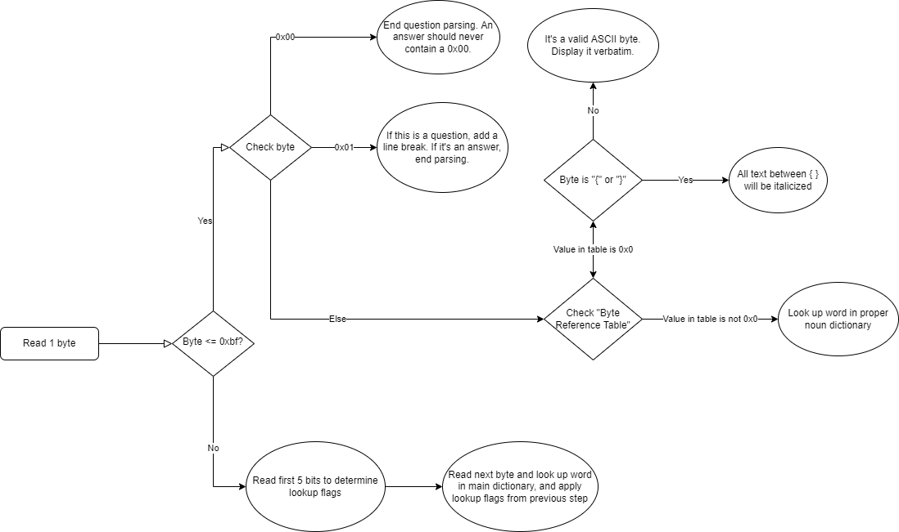

# Notes

## Compression

Quiz and Dragons uses compression to store its extensive text data. As far as I know the compression algorithm is
proprietary. Text data is interpreted by-by-byte, and depending on the value, the byte is either translated using one of
two dictionaries or displayed verbatim as ASCII.

### Main dictionary

The main dictionary starts at address 0x259FC and extends to 0x2936E. Words looked up from this dictionary can have
their capitalization changed (from lowercase to uppercase or vice versa) or be prefaced/suffixed with a space. Each
lookup from this dictionary is 2 bytes.

### Proper noun dictionary

The proper noun dictionary starts at address 0x256EE and extends until the beginning of the main dictionary. Each lookup
from this dictionary is only one byte, so it's utilized for words that always have the same capitalization when they're
used.

### Dictionary format

Each dictionary entry consists of one byte that indicates the length of the word, and then the word itself ASCII
encoded. Some words have special characters such as "'" and "*", but I'm not sure which characters are supported. These
words can be capitalized or lowercase. As an example, the word "Academy" looks like this:

| Length | Word                 |
|--------|----------------------|
| 0x07   | 41 63 61 64 65 6D 79 |

Both dictionaries use the same format.

## Questions/Answers

Starting at 0x29370 are the questions and answers, compressed. The first byte is the length of the questions and answers
INCLUDING the length byte itself. The question is null-terminated, and the first answer immediately follows. The first
answer is the correct answer. Each answer ends with a 0x01. After the fourth 0x01, the next question begins. Answers can
be a maximum of 22 characters long. Questions can be up to 4 lines long with 34 characters per line.

## Compression

When the game reads a byte it goes through a series of checks to determine what to do. The following flowchart explains
how this works at a high level.

### Byte Reference Table

This sort-of confusing table is stored at 0x1DCB6. If a byte is <= 0xBF, it will be looked up here. For instance, 0x03
will cause the game to read 0x1DCB9. If the value at the memory address is 0, it's a valid ASCII character and will be
displayed verbatim. There are a few exceptions to this is. "{" and "}" characters won't render but instead will cause
any contained text to be italicized. Italics have to be terminated by " }.
"<" will render as ♥ and ">" will render as ★. If the value _isn't_ 0, the value is an index in the proper noun
dictionary and that is the word that will be printed.

### Main dictionary lookup flags

Lookups to the main dictionary can be augmented with flags to modify the resolved word. The two-byte binary format is as
follows:

|   |   | Pre-space | Post-space | Flip capitalization | Word Address  |
|---|---|-----------|------------|---------------------|---------------|
| 1 | 1 | 0/1       | 0/1        | 0/1                 | XXXXXXXXXXX   |

The highest two bits are always 1. If pre-space is 1, the looked-up word will have a space prepended to it. If
post-space is 1, it will have a space appended after. If the flip capitalization bit is 1, the word's first letter will
change capitalization. If it is lowercase in the dictionary it will become uppercase. If it's uppercase it will become
lowercase.

## Categories

Questions are split into 14 categories.

### Category offsets

The game determines a question's category based on its location in the question list. 4-byte offsets for each category
are located starting at 0x1DBE6. These offsets are relative to 0x256EE. So since the first offset (at 0x1DBE6) is
0x00003C82, questions from the first category (Art) start from 0x256EE + 0x3C82 = 29370.

### Category names

ASCII category names are located immediately following the offsets, starting at 0x1DC1E. Each name is null-terminated.

### Category question-counts

The number of questions in each category can be found following the category names, starting at 0x1DC9A. Each count is
2-bytes long. 